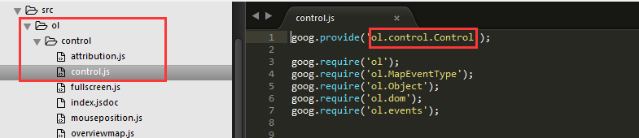

#OpenLayers技术分析
**[OpenLayers](https://openlayers.org/)**是一个高性能，功能丰富的库，满足您所有的映射需求。  
最新版本：4.0.1  
使得在任何网页中放置动态地图变得容易， 它可以显示地图图块，矢量数据和从任何来源加载的标记，已经开发用于进一步使用各种地理信息。完全免费且开源的JavaScript库，根据2条款BSD许可证（也称为FreeBSD）发布。

##特性
- **多源数据支持**：
对Google Maps，Yahoo， OSM，Bing，MapBox，微软Virtual Earth 和其他XYZ等多种来源的瓦片地图的支持；同时也能对GeoJSON、TopoJSON、KML、GML等多种地理矢量数据进行渲染；支持 以OGC 服务形式发布的地图数据加载。
- **前沿技术及高效的渲染能力**：
可以利用WebGL、Canvas  2D以及其他HTML5的特性在当今主流的Web浏览器与移动设备中渲染地图。
- **空间数据计算能力**：
引入了Open GIS 协会制定的WMS（Web Mapping Service）和WFS（Web Feature Service）等网络服务规范，可以对空间数据进行地理分析（ 例如缓冲区分析）。
- **易于自定义和扩展**：
直接使用CSS为地图控件设置样式，可以使用第三方库自定义扩展功能。

##主要的API接口
OpenLayers源码托管在github上（https://github.com/openlayers/openlayers）
- **地图控制器**  
**ol.Map** 地图容器加载多个目标图层，地图投影，地图渲染，图层控制，地图互动操作等事件侦听
- **视图管理**  
**ol.View** 表示地图的简单2D视图，作用于改变地图的中心，分辨率和旋转的对象
- **多源数据加载类**  
**ol.layer.Tile** 瓦片数据  
**ol.layer.Image**  图片数据  
**ol.layer.Vector**  矢量数据  
**ol.layer.VectorTile** 矢量瓦片数据  
**ol.format.WMSCapabilities** 多种格式的地理矢量数据进行渲染  
- **空间坐标系**  
**ol.proj** 投影坐标系的定义和坐标转换ol.proj.transform() and ol.proj.transformExtent()  
- **地图数据交互**  
**ol.interaction.Select** 选择矢量要素  
**ol.interaction.Draw** 绘制几何要素  
**ol.interaction.Modify** 修改几何要素  
- **抽象基类**  
**ol.Object** 通常只用于创建子类，而不是在应用程序中实例化。大多数非平凡类继承自此  
- **地图控件**  
**ol.control** 基本的组件Attribution、Control、FullScreen、MousePosition、OverviewMap、Rotate、ScaleLine、Zoom、ZoomSlider、ZoomToExtent  
**ol.DeviceOrientation** 设备导向，需提供硬件支持，面向移动设备的Web开发  
**ol.Geolocation** 用于提供HTML5地理位置功能  
**ol.Overlay** 在地图上显示并附加到单个地图位置的元素  
- **事件**  
**ol.events**注册（和注销）事件侦听器函数，当被调用时作为事件被调度的结果  
- **几何要素样式及渲染**  
**ol.geom** 几何要素图形Circle、Geometry、GeometryCollection、LinearRing、LineString、MultiLineString、MultiPoint、MultiPolygon、Point、Polygon、SimpleGeometry  
**ol.style** 定义要素样式  
**ol.render** 将几何图形绘制到上下文的画布中  

##扩展插件  
通过扩展OpenLayers或与其集成来提供额外的功能  
- **官方的插件**  
[OL3-Cesium](https://github.com/openlayers/ol-cesium)：Cesium（开源JavaScript框架，多种数据可视化方式，可以绘制各种几何图形、导入图片，甚至3D模型，支持基于时间轴的动态数据展示）一体化整合  
[OL3-LayerSwitcher](https://github.com/walkermatt/ol3-layerswitcher)：图层控制器  
[OL3-Popup](https://github.com/walkermatt/ol3-popup)：地图弹出窗口  
[JSTS](https://github.com/bjornharrtell/jsts)：JavaScript拓扑套件  
[OL3-Geocoder](https://github.com/jonataswalker/ol3-geocoder)：地理编码  
[OL3-Photon](https://github.com/webgeodatavore/ol3-photon)：OpenLayers的Photon地理编码器  
[OL3-ContextMenu](https://github.com/jonataswalker/ol3-contextmenu)：自定义上下文菜单  
[OL3-Google-Maps](https://github.com/mapgears/ol3-google-maps)：Google地图集成库  
[OL3-PanZoom](https://github.com/mapgears/ol3-panzoom)：PanZoom和PanZoomBar控件  
[OL3-Ext](https://github.com/Viglino/ol3-ext)：OpenLayers的错误类和函数  
[OL3-AnimatedCluster](https://github.com/Viglino/ol3-ext)：OpenLayers的集群层，用于在缩放更改时对集群进行动画;以及选择交互，分散集群以允许在其中进行特征选择  
[OL3-Projection-Switcher](https://github.com/nsidc/ol3-projection-switcher)：OpenLayers控件在投影之间切换  
[Ole](https://github.com/boundlessgeo/ole)：集成OpenLayers和Esri ArcGIS REST服务  
- **其他的插件**  
[ol-ext-gh-pages](https://github.com/Viglino/ol3-ext)：OL3拓展系列的组件集，里面分为了Style, Animation, Filter, Interactions等多个有趣的专题  
[ol3-search-layer](https://github.com/webgeodatavore/ol3-search-layer)：图层查询  
[ol3-loadingpanel](https://github.com/eblondel/ol3-loadingpanel)：读条效果  
[ol3editor](https://github.com/programmerg/ol3editor)：地图编辑器，在线制图的一个小demo，适合在有web制图需求的时候使用该组件  
[ol3-echarts3](https://github.com/FreeGIS/Ol3-Echarts)：结合了Echart组件的一个综合体，适合使用在地图信息与属性数据关联紧密，业务逻辑结合地图实现等情景下，将数据在地图上铺开，从而为后续的数据分析与关系挖掘提供基础  
[ol3-mobile-viewer](https://github.com/sourcepole/ol3-mobile-viewer)：是基于OpenLayers 3和jQuery Mobile的基本地图查看器  
[ol3-dem](https://github.com/buddebej/ol3-dem)：渲染斜面浮雕的数字高程模型  
[ol3-react](https://github.com/pka/ol3-react-example)：用于构建用户界面  
[ol3-angular](https://github.com/gsans/ol3-angular)：集成了Angular 与OpenLayers 3  
[OL3-AnimatedCluster](https://github.com/Viglino/OL3-AnimatedCluster)：OpenLayers 3（OL3）的集群层，用于在缩放更改时对集群进行动画;以及选择交互，分散集群以允许在其中进行特征选择  
[ol3-ember](https://github.com/bartvde/ol3-ember)：将OpenLayers 3与Ember.js组合的实验  

##库设计规范  
OpenLayers是基于Google Closure的JavaScript库，也采用了Google Closure的代码书写模式，可以配合Google开源了其内部使用的JavaScript开发工具—— Google Closure Tools可以创造出更快的富Web应用程序。  
OpenLayers库的整个组织结构还是比较扁平简单的，没有太复杂的组织规划。  
>说明：以下代码只是为了表达多种书写方式举例，不是OpenLayers库中真实写法。（虽然一个包中能声明多个类，但建议不要这样做，除非特殊情况。）

- **类实现**  
类声明，使用goog.provide方法声明和注册一个类；  
依赖声明，使用goog.require方法声明具体依赖的其它类；  
对象，类成员变量和成员方法声明和实现（接近javascript原生写法）。  
``` javascript
goog.provide('ol.Map');

goog.require('ol');
goog.require('ol.Collection');
goog.require('ol.CollectionEventType');

ol.Map = function(options) {
  ...
}

ol.Map.prototype.scale = null;

ol.Map.prototype.addLayer = function(layer) {
  ...
};
```
- **命名空间构造和注册**  
一个文件可以当成一个包；  
一个包中能声明（注册）多个类（多个类之间关系都比较密切[Map 和 Map.Layer]，一般存在直接引用或者逻辑上是包含关系[MapBrowserEvent和MapBrowserEventType]，一般不超过三个）；  
根据OpenLayers源码的文件物理结构，我们可以发现类的命名空间和文件夹结构基本是一一对应的，但却不是完全对应。  
``` javascript
//ol/map.js
goog.provide('ol.Map');
goog.provide('ol.Map.Layer');
```
``` javascript
//ol/MapBrowserEvent.js
goog.provide('ol.MapBrowserEvent');
goog.provide('ol.MapBrowserEventType');
```

- **直接依赖包加载**  
所谓直接依赖，就是指在代码实现中有直接引用类或者对象的；  
可以加载任意多个直接依赖的文件包；  
类，依赖和文件之间的关系实现；  
这里只是实现了包对包的依赖，并且这里使用的是异步加载机制，所以无法实现同步调用机制，即方法对包的依赖。  
``` javascript
goog.require('ol.MapEvent');
goog.require('ol.MapEventType');

goog.addDependency("ol/layer/Vector.js", ["ol.MapBrowserEvent", "ol.MapBrowserEventType"]);
```
- **构造函数实现**  
直接使用最原生的方式，简单直接明了；  
参数规范：  
a.所有参数直接使用单个变量形式，不使用把可选参数放到一个options对象中；  
b.针对可选参数，在前面opt_前缀，标识此参数是可选参数；  
使用call形式调用父类构造函数进行初始化,这里就能实现把父类实例对象的数据绑定到当前子类实例对象上，至于父类方法的绑定请继续看下面的继承声明和实现。  
``` javascript
ol.Map = function(opt_el) {
  ol.Object.call(this);
  ...
}
```
- **继承声明和实现**  
通过设置子类的prototype，引入一个含有空构造函数的tempObj类，实现父类纯方法的继承；  
通过增加一个superClass变量指向父类的prototype，实现父类方法的直接调用，而不用担心子类重写了父类的方法，类似java的super调用；  
通过增加constructor变量指向子类自己，实现Js原生数据类型的 constructor 引用。  
``` javascript
ol.inherits(ol.Object);

ol.inherits = function(childObj, parentObj){
  function tempObj() {};
  tempObj.prototype = childObj.prototype;
  childObj.prototype = new tempObj();
  childObj.superClass_ = parentObj.prototype;
 
  childObj.prototype.constructor = childObj;
};
```
- **属性声明**  
常量使用全大写，单词之间使用下划线分割；  
很少的公有变量；  
私有变量在后面添加下划线标识；  
使用getter和setter访问私有变量；  
没有保护权限的变量。  
``` javascript
ol.OL_URL = 'https://openlayers.org/';

ol.Map.scale_ = null;
ol.Map.prototype.alpha = goog.getCssName('...');
```
- **方法实现**  
使用prototype声明方法；  
私有方法和私有变量保持一致，在后面添加下划线标识；  
公有方法直接声明；  
没有保护权限的方法。  
``` javascript
ol.Map.addLayer_ = function() {
  ...
};

ol.Map.prototype.addLayer = function() {
  ...
};
```
- **扩展工具—Google Closure Tools**  
Closure工具包括了JavaScript优化器，移除不需要的代码，压缩其余的代码以实现速度最大化；  
与Firebug协同工作的Firefox扩展Closure Inspector，目的是简化调试；  
Closure 编译器，能以命令行、Web应用或Firefox扩展形式运行；  
Closure Library，Google的标准JavaScript类库；  
Closure Templates 提供了一组预编译的JavaScript接口组件。  
