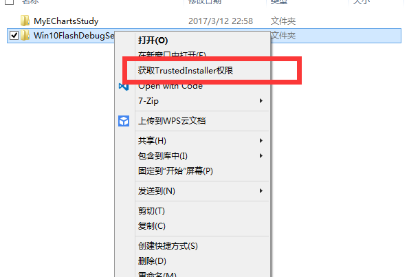
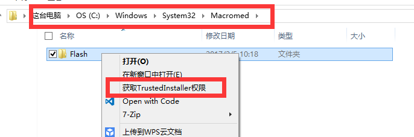
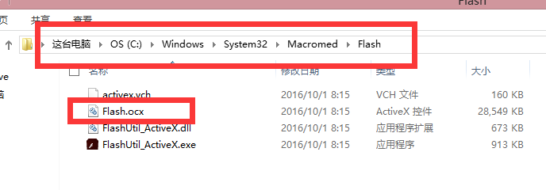
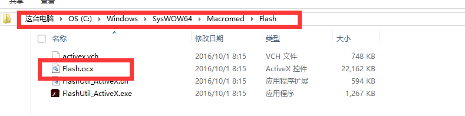

# windows10系统下如何让IE使用调试版Flash

## 背景
### 1.win10系统中flash是内置的，并且由于Adobe公司不再维护Flex语言，所以也不再针对win10系统推出适用于IE的Flash补丁以开启IE的Flash调试模式。        
### 2.win10系统若想使用Flash调试版本，只能选择火狐浏览器，并下载火狐版本的flash调试版，但火狐浏览器的flash调试模式体验很差，经常在调试的时候导致flash崩溃。

## 解决方法
### 微软官方社区的管理员提供了一种解决方法，即使用win8.1系统的调试版flash文件来替代win10下的flash文件，从而实现win10下使用Flash Debug。

## 具体操作

### 1.替换系统文件需要系统TrustedInstaller权限(此为系统最高权限，可以操作系统任何文件，请谨慎操作)，使用我提供的注册表可在右键菜单中添加获取最高权限的选项。

### 注册表合并后在文件右键菜单就会有一个获取权限的选项。

### 2.获取win10系统中关于Flash的两个文件夹的最高权限，以便替换文件，文件路径分别为C:\Windows\System32\Macromed\Flash，C:\Windows\SysWOW64\Macromed\Flash，分别对应了32位和64位。替换其中的Flash.ocx文件即可。

### 注：win10会自动更新flash，每次flash更新后都要替换这两个文件，上述资源路径https://github.com/Hertz9409/Win10FlashDebugSet/tree/master/flash。
