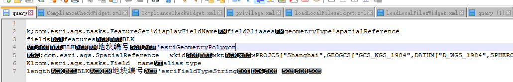
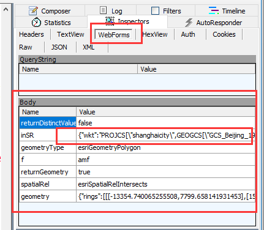
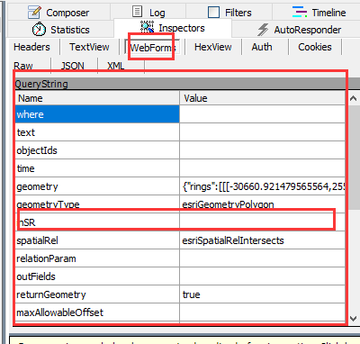
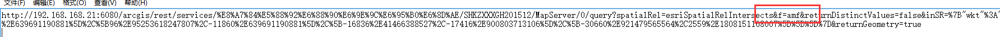
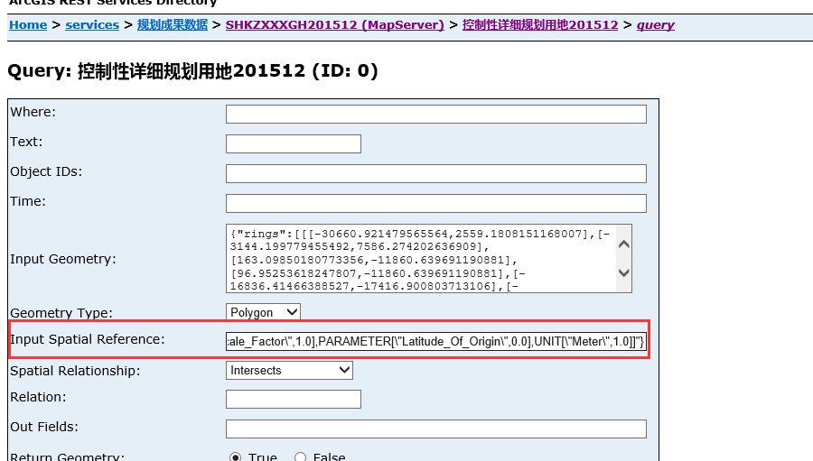
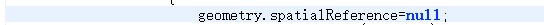
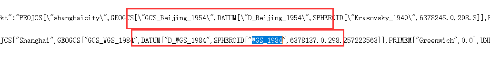

# 解决query查询输入geometry参数查询不到而通过where条件可以查到的问题
## 原因:
###  是因为geometry的坐标系和所要查询的图层不一样导致的（问题引起是由于底图中叠加了不同的坐标系的引起的） ###
## 问题描述：
### 我在公司做好的功能并且测好了，到现场出了问题，发现通过where语句查询时正常的，拉宽查询不正常。并且通过网页打开图层查询请求页面，手动输入代码中得到的geometry查询是可以查到数据的 
## 问题解决过程：
### 1.	通过fiddler跟踪请求的http路径（因为arcgisAPI请求arcgisServer是通过http路径进行请求的不管是post还是get方法都可以通过fiddler拿到路径参数，)
### 这个地方有个疑问：按理说如果通过post方法请求不应该可以拿到参数的，这个问题有同学感兴趣的可以去研究一下，（我记得在某片文章中看到过arcgis api的post方法不是我们传统意义上表单post请求传参) 
### 2.	拿到参数后在浏览器中输入参数回车发现会下载一个query文件用编辑器打开里面是一些查询信息，信息不是很好解读

### 3.	又回到fiddler中跟踪网页查询和代码调用的区别
### 代码调用: ###

### 网页调用： ###

### 有没有发现问题，问题在于代码调用中inSR这个参数中有一个参考系的值，大概猜出是这个参数引起了问题，但是并不知怎么解 ###
###  4.	回到浏览器中对比fiddler中复制的正常网页查询的url和代码调用的url，发现有一个细微差别
### 网页调用： ###

### 代码调用： ### 

### 这是记起是返回值显示格式（html, amf,json）所以把代码中的路径中的“amf”改成”html”问题找到了 ###

### 这是就是我们的查询页面，并且自动输入了查询参数，里面InputSpatialReference参数中输入了fiddler中的InSR值，这时就对应上了输入的参数 
### 5.	找到问题，就到代码中去找这个输入参数，发现query对象中没有这个参数的输入，后思考后得出应该是继承了输入geometry中的坐标系参数，后去掉geometry中的坐标系参数，发现可以查出来了，到这一步问题已经解决。

### 6.	后面我又想了解一下为什么会出现这个问题，我又在网页查询页面InputSpatialReference这个参数中输入当前服务的坐标系参数发现是可以查到的，这是才想起了应该是参考系不一样导致的，果然在对比了两个坐标系发现一个是北京54的另一个是WGS_1984的坐标系。

### 后面又去找这个问题，发现他们的底图是北京54的坐标系，而我们查询的专题是1984的坐标系统，而我们的DrawTool对象要绑定一个map对象，而地图对象的坐标系统正好也是底图的坐标系可以通过他去看distmap.map.spatialReference（北京54）
### 可能是这个时候默认是map底图的坐标系（暂时没去探究，感兴趣的可以去研究一下）。 ###

