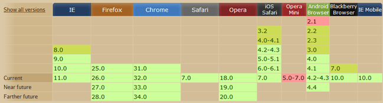

# 图标字体技术

做项目的时候通常会用到各种各样的图标，通常我们直接使用UI切好的png图片，然后通过制作Sprite图来使用这些图片，但是这样做有诸多弊端，首先图片颜色和大小无法自主控制大小，如果涉及到在图标上的样式变化实现起来就很繁琐，再者如果涉及到屏幕放大的情况（如移动端）会造成图片模糊不清的情况。为了解决这些问题可以使用Icon Font技术。一般来说UI框架会提供相应的图标字体库，如Bootstrap使用的是font awesome图标库，MetroUI也有自己的图标库，小智使用的就是MetroUI的图标库。

如下图：

## 图标字体的优劣势

1.**轻量性** 

图标字体比一系列的图像要小。一旦图标字体加载了，图标就会马上渲染出来，不需要下载一个图像。可以减少HTTP请求，还可以配合HTML5离线存储做性能优化。

2.**灵活性**

图标字体可以用过font-size属性设置其任何大小，还可以加各种文字效果，包括颜色、Hover状态、透明度、阴影和翻转等效果。可以在任何背景下显示。使用位图的话，必须得为每个不同大小和不同效果的图像输出一个不同文件。

3.**兼容性**

网页字体支持所有现代浏览器，包括IE低版本

除了以上优势之外，当然也有劣势

1、图标字体只能被渲染成单色或者CSS3的渐变色。
2、使用版权上有限制，有好多字体是收费的。当然也有很多免费开源的精美字体图标供下载使用。
3、创作自已的字体图标很费时间，重构人员后期维护的成本偏高。

## 制作自已图标字体

1.首先需要有创建矢量图标的软件，并且能够输出SVG格式,比如AI。或者直接去免费的图标网站下载需要的svg格式的图片

2.把SVG格式的图标导入到[icomoon](http://icomoon.io/app/)、[fontello](http://fontello.com/)、[iconfont](http://www.iconfont.cn/)字体生成器中，去生成所要的图标字体。

**图标字体生成器**

IcoMoon！一个可以通过个性化设置来创建自定义图标（字体）的生成器！IcoMoon是一项免费的服务，通过使用不同设置使我们能够创建自定义的Icon图或Icon字体。除了自定义Icon外，IcoMoon也有自己免费的海量图标集。

1.打开http://icomoon.io/app/， 点击Start the App按钮。

2.点击Import Icons按钮导入SVG图标，导入后对图标进行相关的操作，如选中、删除、移动、编辑等。

3.编辑完成后，就可以进行下载了,有多种格式供我们选择（EOT,SVG,WOFF,TTF）。

如果要兼容IE7以下浏览器，请在设置里勾选Support IE7(and older)选项，会生成一个单独JS、CSS文件。

下载ZIP包后，解压后会得到如下图的文件。将fonts文件夹复制到你的网站，为项目添加字体。
从style.css文件中复制CSS样式，并粘贴到你网站的CSS文件中，也可以单独存成一个样式文件。

复制完成后，在CSS文件中找到@font-face，将URL路径修改成你本地的相对路径。

字体和路径都设置完成后，在HTML页面只需调用相对应的class就可以了。如果想兼容IE7浏览器，需引用IE7目录的js。如：

调用class：
调用js：
