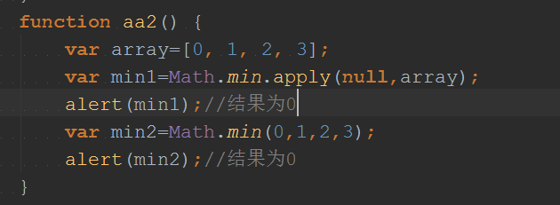

# 1. call() 和apply() 作用：
### 因为js没有私有类的概念，我们在做组件开发的时候经常会用到这两个方法来实现你的组件，理解这个同时也有助于理解js"this"的取值(是执行上下文环境的一部分)
# 2.call() 和apply() 来源：
### call()和apply() 是Function()的成员方法，其他方法是通过"--proto--"(隐式原型)继承Function()得到的。
;
# 3.call() 和apply() 区别：
### 本质上来个东西是一样的，唯一的区别是传的参数不一样 ###
### Function.apply(obj,args)方法能接收两个参数 obj：这个对象将代替Function类里this对象 args：这个是数组，它将作为参数传给Function（args-->arguments）
### Function.call(obj,[param1[,param2[,…[,paramN]]]]obj：这个对象将代替Function类里this对象 params：这个是一个参数列表
# 4.用法理解：
## 4.1 apply自动将参数数组，转为参数列表
### 在碰到某个方法传的死参数列表，而你自己现有的数据是参数数组，这个时候可以用通过它很方便的进行处理
### eg: ###
### 获取数组中最大值和最小值时： ###

### 
## 4.2 改变方法类部的this作用域
;
;

